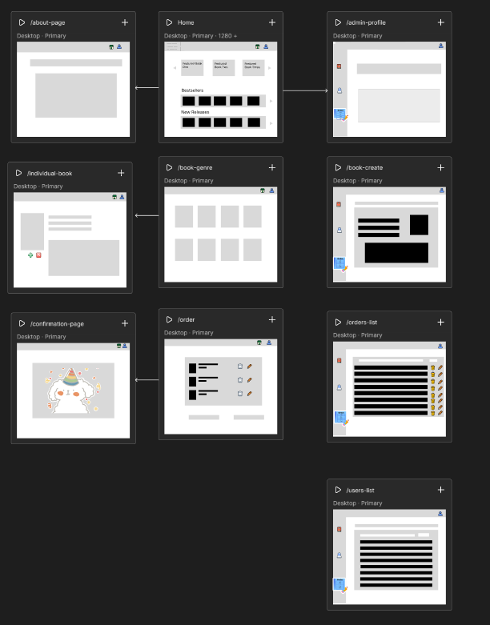
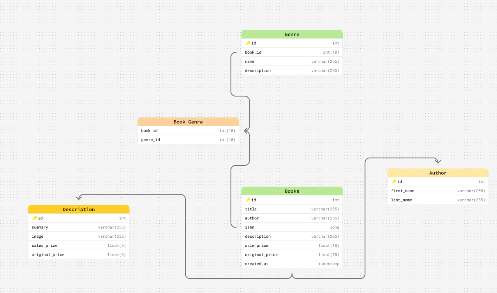

#  📚 Books and Brews ☕
**Capstone Project for LaunchCode**

---

## Table of Contents
- [Project Overview](#project-overview)
- [Technologies Used](#technologies-used)
- [Installation Instructions](#installation-instructions)
- [Wireframe](#wireframe)
- [Entity Relationship Diagram](#entity-relationship-diagram-erd)
- [Problems](#problems)
- [Future Features](#future-features)

---

## 📖 Project Overview
**Books and Brews** is a full-stack e-commerce web application that allows users to view books within

Admin users are able to add/edit/delete artist's from an artist list as well as a book list which will show on the main page in pre-filtered genres. 

This project shows learned skills through the LaunchCode FullStack Web Development Bootcamp such as Spring Boot, React, RESTful API integration, front-end and back-end skills.  

---

## 💻 Technologies used

| Tools/Frameworks | Description|
|:-- | :-- |
| **JavaScript** | A versatile and powerful programming language that adds interactivity to websites |
| **React** | Used to create dynamic and interactive web apps by breaking down the UI into resuable component |
| **TailwindCss** | A CSS-framework that allows devs to build custom user interfaces quickly and efficiently |
| **Java** | An object oriented programming language that is versatile and reliable for many digital services and applications |
| **SpringBoot** | A Java Framework designed to simplify the creation and deployment of Java application |
| **MySQL** | A popular database software that uses SQL to organize and manage data |
| **Git** | A version control system that tracks changeds in files and is used for source code management in software development |
| **PostMan** | An API development and testing platform that allows developers to  design, test, document, and automate APIs through a user-friendly interface |

---

## ⚙️ Installation Instructions

To run the app locally:
```bash
# 1️⃣ Clone the repository in Vite 
git clone https://github.com/cahhi/unit-2-books-and-brews-chrissy-r

# 2️⃣ Navigate to the frontend 
cd books-and-brews-front-end

# 3️⃣ Install the needed dependencies
npm install

# 4️⃣ Run the development server
npm run dev
```
🔑 The frontend app should start and can be found in the browser typically at `http://localhost:5173`

---

If you are running the backend separately:
```bash
# 1️⃣ Navigate to the backend 
cd java-spring-boot-backend-app

# 2️⃣ Run the Spring Boot application
./mvnw spring-boot:run
```
---

## Wireframe



*I used Figma to create my wireframe*

---

## Entity Relationship Diagram (ERD)


*I created the ERD using Figma to showcase the relational databases used in this application*

---

## Problems

---

## Future Features!